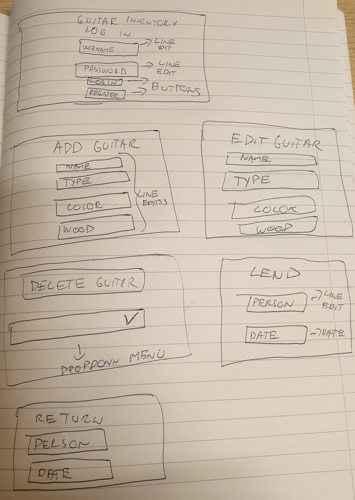
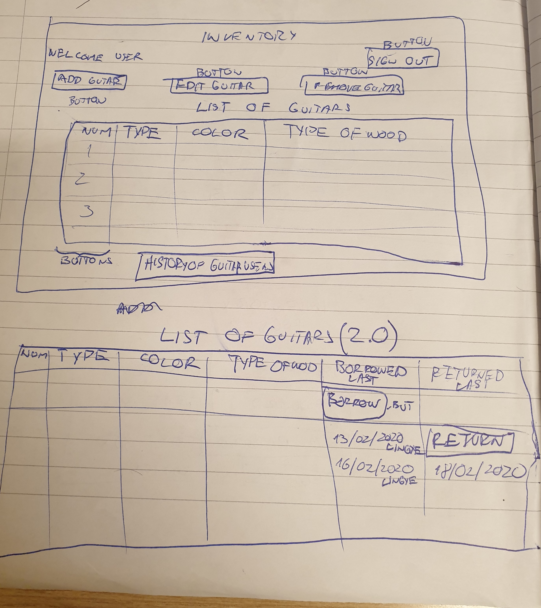

Criteria of success
=======================

# Definition of a problem
Client is Tom, student from UWC ISAK Japan. He wants a system which will enable him to keep track of his guitars. The problem he is facing right now is that he needs to remember to who he lended his guitar and that can lead to missunderstandings. To avoid that, my client was rather not leding his guitar to anyone so inventory will be big improvement. So what he wants now is inventory, where he will be able to add guitar, specify it's properties and than log the date when it was borrowd. Properties he wants to keep track of:
* Name
* Type
* Color
* Type of wood
* Date when borrowed
* Date when returned

## Proposed solution and justification
I am going to design a Guitar Inventory software application with graphical user interface for my client including a secured login system. I am going to use Python The software application will help my client to reliably track who is using which guitar and the characteristics of each of this guitars such as type, colour and type of wood. Justification for each of my decisions:
* **Graphical user interface** - Compared to previous projects, this one will not be terminal based. Instead of commands I will use buttons, instead of text shown in lines, I will be using tables and pictures. This will result in big improvement in usability.
* **Python** - To create that program I will be using python because that is the programing langugage we are learning to code with in class right now. Syntax is not demanding. Huge advantage of python over other programing languages is the amount of librarys and frameworks for it, which makes development faster. In addition to that its syntax is easy to read and it takes much less time to review compared to some other programing lanugages because it actually resembles english. However there are few dissadvantages. In order to run it, cutomer must have Python 3 installed including all libraryes. Also it can be slower compared to some other languages (Java) while processing big amounts of data and updating GUI. But since our program will not be dealing with big amounts of data, we won't notice that in our progaram.

Problem was defined and solution was proposed based on first user email and short interview. Accesible in [appendix folder](/Inventoryproject/Appendix/)

Here are proposed sketches, just basic outline how program will look.

**Fig 1.** First sketch

**Fig 2.** Second sketch

When user comes past first log in window, he will see main inventory window with table of all the guitars, with action buttons of what he can do from there. If customer presses one of the buttons, smaller pop up window opens: ADD GUITAR, EDIT GUITAR, DELETE GUITAR, LEND GUITAR OR DELETE GUITAR.

## Success criteria:
1. Being able to add guitar
1. Specify guitars properties (Type of guitar, color of guitar, type of wood)
1. Beeing able to remove guitar
1. Log date when guitar is borrowed and when returned
1. User can create user name and use his password (which is encrypted) to log in

**Coment on succes criteria** Succes criteria is maybe not defined enaught at this point. I will keep in touch with client, and keep him updated on development to see if his requirements will change.

