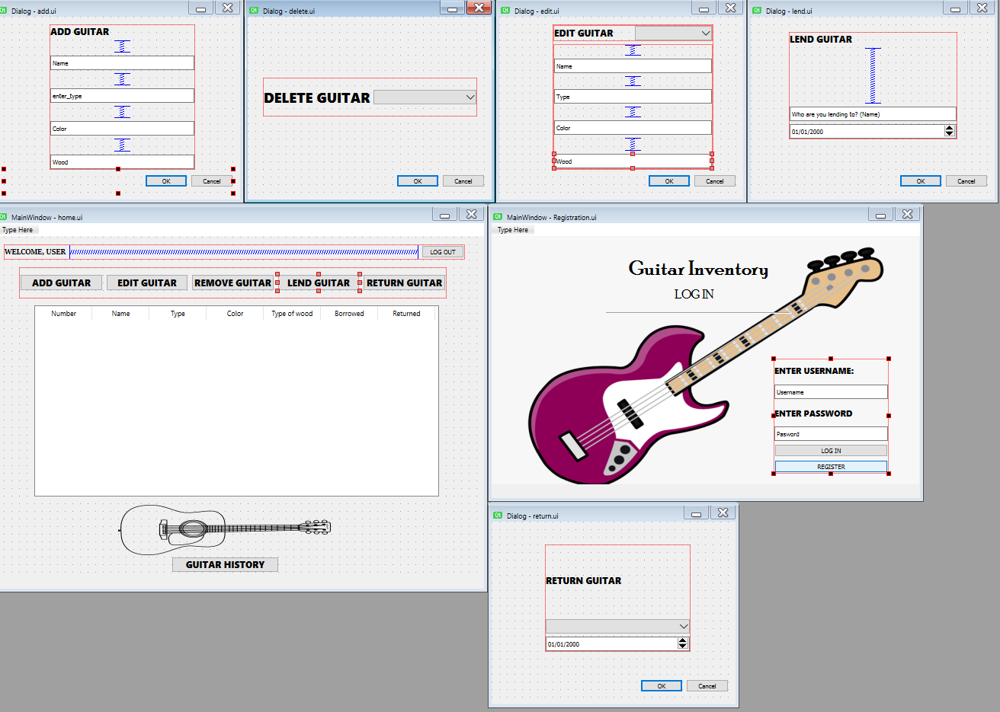
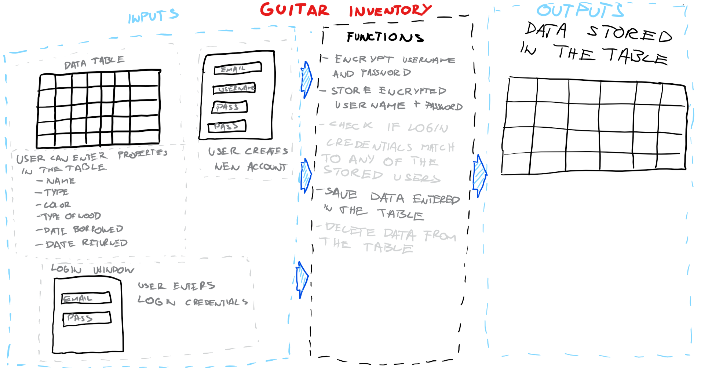
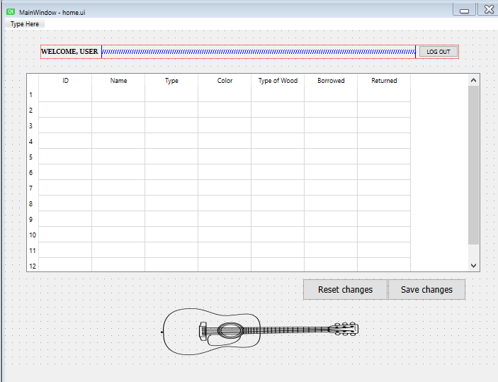
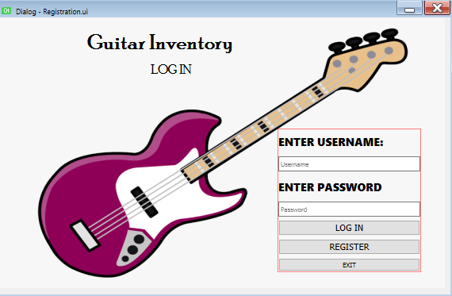
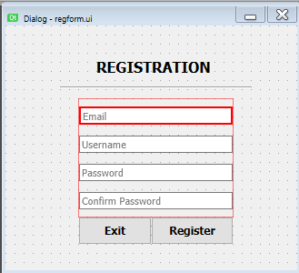
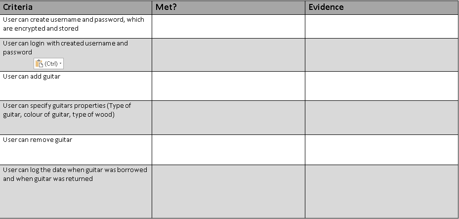

Design
===================

## Design 1.0
Picture below shows how GUI of program will eventually look. Even though this is not compleatly final version, it is preatty close to how final version will look.

**Fig 1.** GUI design

When user enters his credentials home page opens. TAble of guitars is shown there. Buttons open dialog boxes for adding, removing, editing, lending and returning guitar.
* **Registration and login windows** Succes critera num 5. User can create his own username and password to have secure login
* **Add, edit and remove guitar windows** Succes crieria num 1. 2. 3. User can add guitar, specify its properties, edit them and then delete them
* **Borrow and return guitar** Succes crietira num 4. User can log the date when guitar was borrowed and returned

## Design 2.0
Due to not knowing tools I was using before the start of development and to running out of time, desings got simpler in final stage of the develpomnet. Since you are able to add edit and delete - all that in the QT Table Widget, I don't need to code each function seperatley. I can just update data base every time change in table is made, which was really convinient to finish the program soon enaugh.

**Fig 2.** System diagram for design 2.0

As we can see on Fig 2, most of the pop up windows are eliminated. All the edits are made in the table. The only 2 windows I still kept are login and register window. When user enters registration credentials, his email and password are hashed and stored in the database. When user tries to login, his login credentials are comapred against stored hash.

**Fig 3.** Home page with the table.

Now it has only 3 buttons. One for logging out and closing the program. The other 2 buttons are for saving or canceling the changes in the table.

**Fig 4.** Login page

User can login from this page pressing LOGIN button. If new user wants to register in the applciation, they can press register button which takes them to register window bellow:

**Fig 5.** Registration window

User can register themselves from this window. In order to do that they need to meet few requirements. Email must contain **@**, Username must be only from characters and longer than 5. Passwords must be longer than 5 and they need to match.

## Testing plan
Table on Fig 6 is created accroding to succes criteria and will be used for evaluation in criteria D:

**Fig 6.** Testing table
