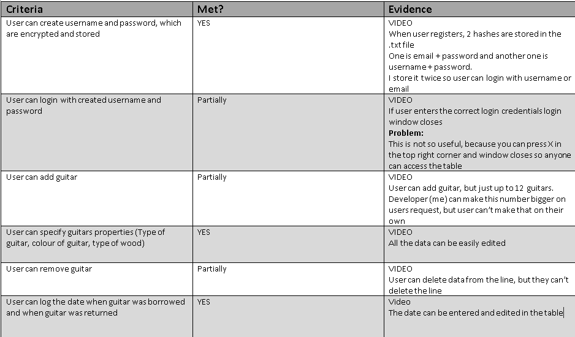

Succes crieria
-----------------



**Fig 1** Succes criteria table

Video with demonstraion [here](https://drive.google.com/open?id=1U6_z44P32-PE5B7sVRa5u7AHbeTkgKQt).

Evaluation
----------------------------
Most of the client requirements were met but due to online learning and lack of time I was not able to meet all the requirements. All the issues listed below:
1. The first and biggets issue is secure login. User is able create his own username and password, and login with them. But point of secure login is that you can't see the data without right login credentials which is not the case here. Although u can't interact with the table while login window is opened, you can still move it around and see the table behind it. And what's even worse, you can simply press x in the top right corrner or use windows keyboard shortcut ```alt + F4 ```, close the login window and have full acces to the inventory.
2. The seccond big issue is that user can't add or remove lines from the table. Lines can be added or removed by developer uppon users request, but not by user directly from the GUI. As of right now, there is 12 lines by default. User can enter, edit, and delete data from them but they are limited to the default number.

Improvements
--------------
1. Right now user is editing and interacting with data only by editing a spread sheet. It would be nicer, and more user friendly if I would follow my orignial desingn planes and crate separate window for each of the actions we want to perform
1. I could add some organisation functionalities, maybe search functionality, filter functionality, I could notify the user when someone has not returned guitar for the long time... Right now my inventory program is just a spread sheet with secure login which is not even secure, so realisticly there is no added value or functionality with using my inventory program compared to excel or google sheets for example.


