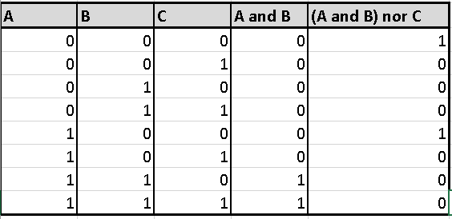

Week 28 Syllabus quetions
===========================

### Question 1
One usability issue could be short battrery life. Limited space in mobile device restircts manufacutures from puting biger bateries in mobile devices, which can result of phone runing out of battery before end of the day.

### Question 2

### Question 3
Protocol, in computer science, a set of rules or procedures for transmitting data between electronic devices, such as computers. 
